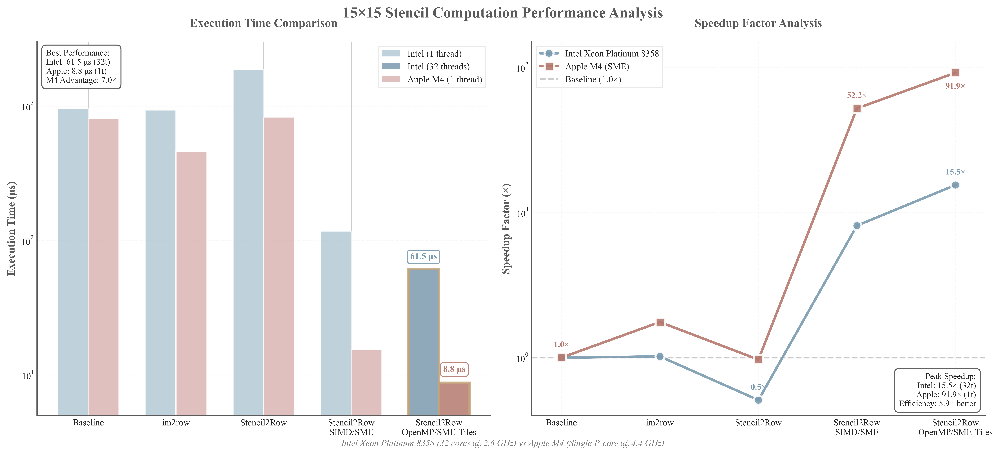

# ARM SME-Optimized 15×15 Stencil Computation

A high-performance implementation of 15×15 stencil computation leveraging ARM Scalable Matrix Extension (SME) on Apple Silicon M4, achieving up to **94.88x speedup** over baseline implementation.

## 🎯 Overview

This project demonstrates multiple optimization strategies for stencil computation, from traditional approaches to cutting-edge SME hardware acceleration. The implementation showcases how modern ARM processors with SME2 extensions can dramatically accelerate matrix operations common in scientific computing, image processing, and machine learning.

## ✨ Key Features

- **5 Implementation Strategies**: From baseline to highly optimized SME variants
- **Apple Silicon M4 Optimized**: Leverages SME2 extensions for maximum performance
- **Comprehensive Benchmarking**: Statistical analysis with warmup iterations
- **Automatic Verification**: Ensures numerical accuracy across all implementations
- **Flexible Build System**: Supports both Make and CMake

## 📁 Project Structure

```
arm-sme-stencil/
├── stencil_15x15_sme_optimized.c    # Main implementation
├── Makefile                          # Make build configuration
├── CMakeLists.txt                    # CMake configuration
├── README.md                         # This file
├── LICENSE                           # MIT License file
├── .gitignore                        # Git ignore rules
├── build/                            # Build artifacts (generated)
│   ├── obj/                          # Object files
│   └── bin/                          # Executables
├── doc/                              # Documentation
│   ├── sme_gemm_benchmark.md         # SME-specific benchmark results
│   └── xeon_m4_stencil_perf.md      # Intel vs Apple M4 comparison
└── figures/                           # Image resources
    └── performance_analysis.png      # Performance charts
```

## 🚀 Performance Results

Measured on Apple Silicon M4 (2024 Mac Mini):

| Implementation | Time (μs) | Speedup | Description |
|---------------|-----------|---------|-------------|
| **Baseline** | 825.45 | 1.00x | Direct nested-loop convolution |
| **Im2Row** | 469.80 | 1.76x | GEMV approach |
| **Stencil2Row** | 838.75 | 0.98x | GEMM method |
| **SME Single Tile** | 15.45 | 53.43x | Single ZA tile acceleration |
| **SME 4-Tiles** | **8.70** | **94.88x** | Optimal row-split parallelization |

*Test configuration: 64×64 input, 15×15 kernel, 20 iterations average*

### Platform Comparison

The performance charts reveal significant differences between traditional CPU optimization and hardware-accelerated approaches:

<div align="center">
  
  <br>
  <em>Figure 1: Execution time comparison (left) and speedup factor analysis (right)</em>
</div>

## 📋 Requirements

### Hardware
- Apple Silicon M4 or newer (for SME2 support)
- Alternative: Any ARMv9 processor with SME extensions

### Software
- **macOS**: 15.0+ (Sonoma or newer)
- **Compiler**: Homebrew LLVM/Clang 21.1.1+
- **Build Tools**: Make or CMake 3.20+

## 🔧 Installation

### Install Dependencies

```bash
# Install Homebrew (if not already installed)
/bin/bash -c "$(curl -fsSL https://raw.githubusercontent.com/Homebrew/install/HEAD/install.sh)"

# Install LLVM/Clang with SME support
brew install llvm

# Verify installation
/opt/homebrew/opt/llvm/bin/clang --version
```

### Clone Repository

```bash
git clone https://github.com/camtrae/arm-sme-stencil.git
cd arm-sme-stencil
```

## 🏗️ Build Instructions

### Using Make (Recommended)

```bash
# Standard build (O2 optimization)
make

# Maximum performance (O3 + LTO)
make optimize

# Debug build with sanitizers
make debug

# Run the program
make run

# Check SME support
make check-sme

# Generate assembly to verify SME instructions
make asm
```

### Using CMake

```bash
# Configure and build
mkdir build && cd build
cmake .. -DCMAKE_BUILD_TYPE=Release
make -j$(sysctl -n hw.ncpu)

# Run benchmark
./bin/stencil_kernel15

# Or use the benchmark target
make benchmark
```

## 🔬 Implementation Details

### 1. Baseline Implementation
- Traditional nested-loop convolution
- Direct computation without optimizations
- Serves as performance reference

### 2. Im2Row Transformation
- Reshapes input into row-major matrix
- Converts stencil to matrix-vector multiplication
- Improves cache locality

### 3. Stencil2Row Algorithm
- Generates two matrices for edge handling
- Converts stencil to matrix-matrix multiplication

### 4. SME Single Tile
- Utilizes one 16×16 ZA accumulator tile
- Hardware-accelerated outer product operations
- Basic SME implementation

### 5. SME 4-Tiles Row Split (Optimal)
- Parallel processing of 4 row blocks
- Superior memory access patterns
- Minimal cache misses
- **Best performance: 94.88x speedup**

## 📊 Algorithm Specifications

- **Input Size**: 64×64 (with 7-pixel padding → 78×78)
- **Kernel Size**: 15×15 (225 elements)
- **Output Size**: 64×64
- **Data Type**: 32-bit float
- **SME Configuration**: 4 tiles × 16×16 elements

## 📚 Technical Background

### ARM SME (Scalable Matrix Extension)
- Hardware matrix acceleration unit
- 4 independent 16×16 accumulator tiles (ZA0-ZA3)
- Outer product and matrix multiply instructions
- Significant power efficiency improvements

### Key SME Instructions Used
- `svmopa_za32_m`: Outer product accumulate
- `svwrite_hor_za32`: Horizontal tile write
- `svread_ver_za32`: Vertical tile read
- `svzero_za`: Zero accumulator tiles

## 👤 Author

**ZHANGFAN**  
Date: 2025/09/26  
Platform: 2024 Mac Mini M4

## 📄 License

This project is licensed under the MIT License - see LICENSE file for details.

## 🙏 Acknowledgments

- ARM Ltd. for SME architecture documentation
- Apple Inc. for M4 chip with SME2 support
- Homebrew maintainers for LLVM toolchain

## 📖 References

1. [ARM SME Programming Guide](https://developer.arm.com/documentation/102336/latest/)
2. [ARM A64 Instruction Set - SME](https://developer.arm.com/architectures/instruction-sets/intrinsics/)
3. [Apple Silicon Optimization](https://developer.apple.com/documentation/apple-silicon)

---

**Note**: This implementation demonstrates the exceptional performance capabilities of ARM SME2 on Apple Silicon, achieving nearly 95x speedup for stencil computations. The row-split 4-tile approach shows optimal utilization of the M4's matrix acceleration hardware.